# NFC Message

[](https://github.com/masanthimanshu/nfc-message/actions/workflows/deploy-serverless.yaml)
[](https://nodejs.org/)
[](https://www.serverless.com/)
[](https://aws.amazon.com/lambda/)
[](https://aws.amazon.com/bedrock/)
[](https://opensource.org/licenses/ISC)

An intelligent, context-aware serverless backend that transforms real-time device telemetry into personalized, emoji-rich WhatsApp messages using **Amazon Bedrock** (`google.gemma-3-12b-it`). Triggered via physical NFC tags or mobile automations (such as iOS Shortcuts), the service evaluates proximity to designated geofenced locations (home, office, or in transit), battery level, local weather, and time of day to synthesize a message tailored to your partner or family.

---

## Architecture Overview

```mermaid
flowchart LR
    A[NFC Tag / iOS Shortcut] -->|POST /text/message| B[Amazon API Gateway]
    B --> C[AWS Lambda<br/>Node.js 24 + Express 5]
    C -->|Fetch System Prompt| D[AWS Systems Manager<br/>Parameter Store]
    C -->|Calculate Proximity| E[Geolib Utility]
    C -->|Invoke Gemma-3-12b| F[Amazon Bedrock]
    C -->|Store Input & Output| G[(Amazon DynamoDB)]
    C -->|Structured Logs| H[Amazon CloudWatch]
    C -->|Return Response| A
```



### How It Works

1. **Context Collection**: A physical NFC tap triggers a mobile shortcut that captures current telemetry: GPS latitude/longitude, battery level, current weather, address, and estimated commute duration.
2. **Validation & Geofencing**: Express validates the payload with Zod and compares coordinates against defined locations in [data/coordinates.json](data/coordinates.json) using `geolib`.
3. **Dynamic Prompt Synthesis**: Incorporates current local time (`Asia/Kolkata`), weather conditions, location state (e.g. departing home, at office, in transit), and battery warnings if critically low (`< 20%`).
4. **AI Generation**: Retrieves the system prompt from AWS SSM Parameter Store and queries Google Gemma 3 via Amazon Bedrock along with few-shot guidance from [data/messages.json](data/messages.json).
5. **Persistence & Response**: Saves input payload and generated message to DynamoDB (`nfc-messages-table`) with conditional guarantees, returning the formatted message back to the device to send.

---

## Key Features

- **Context-Aware Prompt Generation**: Dynamically evaluates transit state, time of day, and battery health to assemble human-like prompts.
- **Generative AI via Amazon Bedrock**: Leverages `google.gemma-3-12b-it` model on AWS Bedrock for fast, natural message generation.
- **Dynamic Configuration**: System instructions are stored in AWS Systems Manager (SSM) Parameter Store, enabling prompt updates without code redeployment.
- **Audit Persistence**: Every incoming request and generated output is preserved in DynamoDB with UUIDs and ISO timestamps.
- **Type-Safe Validation**: Strict schema enforcement using Zod prevents malformed inputs.
- **Structured Observability**: Formatted JSON logging with CloudWatch Logs integration.
- **Production-Ready Serverless Stack**: Built with Express 5, `serverless-http`, ES Modules, and Node.js subpath imports (`#core/*`, `#data/*`, `#utils/*`).

---

## Project Structure

```text
nfc-message/
├── .github/
│   └── workflows/
│       └── deploy-serverless.yaml  # GitHub Actions CI/CD deployment pipeline
├── aws/
│   ├── database.yaml              # DynamoDB table definition (CloudFormation)
│   └── iam.yaml                   # Lambda IAM roles and service permissions
├── core/
│   ├── bedrock_client.js          # Amazon Bedrock client & model invocation
│   ├── cloudwatch_logs.js         # Structured JSON logger for CloudWatch
│   ├── dynamo_client.js           # DynamoDB DocumentClient operations
│   └── parameter_store.js         # AWS SSM Parameter Store client
├── data/
│   ├── coordinates.json           # Geofence reference coordinates (home & office)
│   ├── messages.json              # Few-shot prompt examples for LLM
│   └── validator.js               # Zod input validation schemas & middleware
├── src/
│   └── text/
│       ├── controller.js          # Route orchestration & business logic
│       ├── handler.js             # Serverless Lambda entrypoint
│       └── routes.js              # Express route declarations
├── utils/
│   ├── create_app.js              # Express application factory
│   └── user_prompt.js             # Geofencing & context prompt builder
├── eslint.config.js               # ESLint 10 configuration
├── package.json                   # Project dependencies and npm scripts
└── serverless.yaml                # Serverless Framework configuration
```

---

## Getting Started

### Prerequisites

- [Node.js](https://nodejs.org/) (version 24.x recommended)
- [Serverless Framework](https://www.serverless.com/) (`npm install -g serverless` or use local `npx serverless`)
- An active [AWS Account](https://aws.amazon.com/) with configured credentials (`~/.aws/credentials`)
- Amazon Bedrock model access granted for `google.gemma-3-12b-it` in your target region (`ap-south-1`)

### Installation

1. Clone the repository:

   ```bash
   git clone https://github.com/masanthimanshu/nfc-message.git
   cd nfc-message
   ```

2. Install dependencies:

   ```bash
   npm install
   ```

### Configuration

1. **Environment Variables**: Create a `.env` file in the project root:

   ```env
   AWS_PROFILE=your-aws-profile
   ```

2. **AWS SSM Parameter Store**: Set up the system prompt parameter in AWS Systems Manager:
   - **Parameter Name**: `/nfc-message/lambda/message`
   - **Type**: `String`
   - **Value**: System instructions dictating tone, role, and emoji density for the generated messages.

3. **Geofencing Coordinates**: Configure your target base coordinates in [data/coordinates.json](data/coordinates.json):

   ```json
   {
     "home": { "latitude": 28.55021, "longitude": 77.374722 },
     "office": { "latitude": 28.513297, "longitude": 77.373179 }
   }
   ```

### Local Development

Run the API locally using `serverless-offline`:

```bash
npm run dev
```

The offline server starts by default on `http://localhost:3000`.

---

## API Reference

### 1. Health Check

Verify service availability:

- **Method**: `GET`
- **Path**: `/text/health`
- **Response**:

  ```json
  {
    "status": "Text API route is working!!"
  }
  ```

### 2. Generate Message

Synthesizes a personalized message from real-time device context.

- **Method**: `POST`
- **Path**: `/text/message`
- **Headers**: `Content-Type: application/json`
- **Request Body**:

  ```json
  {
    "address": "Sector 62, Noida, Uttar Pradesh",
    "weather": "32°C and Sunny",
    "homeTime": "35 mins",
    "officeTime": "20 mins",
    "latitude": "28.5133",
    "longitude": "77.3731",
    "batteryLevel": "15"
  }
  ```

- **Example Response**:

  ```json
  {
    "message": "Hey Chiku! 🥰 Leaving office now, should be home in about 35 mins! 🚗💨 Also phone battery is at 15% so don't panic if it shuts off! 😘💖"
  }
  ```

---

## Deployment

### Manual Deployment

Deploy directly to AWS using Serverless Framework:

```bash
npm run deploy
```

### CI/CD Deployment

The repository includes a GitHub Actions workflow in [.github/workflows/deploy-serverless.yaml](.github/workflows/deploy-serverless.yaml). Pushing to the `main` branch automatically triggers deployment using the following GitHub repository secrets:

- `AWS_ACCESS_KEY_ID`
- `AWS_SECRET_ACCESS_KEY`
- `SERVERLESS_ACCESS_KEY`

---

## Support & Resources

- [Serverless Framework Documentation](https://www.serverless.com/framework/docs)
- [Amazon Bedrock Developer Guide](https://docs.aws.amazon.com/bedrock/)
- [Express Documentation](https://expressjs.com/)
- [Issue Tracker](https://github.com/masanthimanshu/nfc-message/issues)

---

## Maintainers & Contributing

Maintained by **[Himanshu](https://github.com/masanthimanshu)** (<masanthimanshu@gmail.com>).

Contributions and feature suggestions are welcome! Feel free to open an issue or submit a pull request:

1. Fork the repository
2. Create a feature branch (`git checkout -b feature/amazing-feature`)
3. Commit your changes (`git commit -m 'Add amazing feature'`)
4. Push to the branch (`git push origin feature/amazing-feature`)
5. Open a Pull Request

---

## License

This project is licensed under the [ISC License](https://opensource.org/licenses/ISC).
