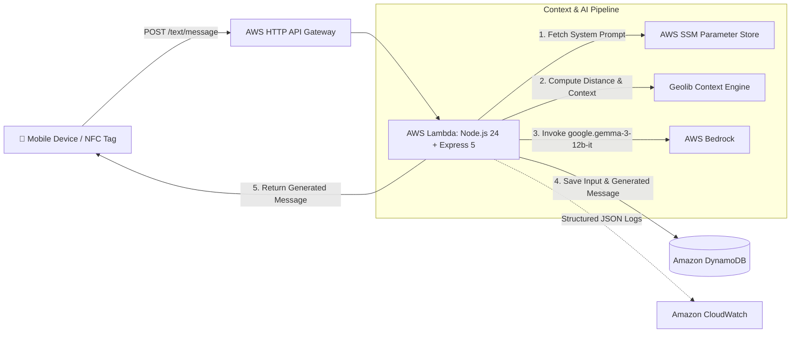

# NFC Contextual Message Generator

[](https://nodejs.org/)
[](https://www.serverless.com/)
[-FF9900.svg>)](https://aws.amazon.com/bedrock/)
[](https://aws.amazon.com/dynamodb/)
[](https://opensource.org/licenses/ISC)

A serverless backend microservice designed to craft intelligent, context-aware WhatsApp messages when triggered by an NFC tag tap, iOS Shortcut, or mobile automation routine.

By analyzing real-time GPS coordinates, transit estimates, battery status, and local weather, `nfc-message` dynamically constructs situational prompts and leverages **Google Gemma 3 (12B)** on **AWS Bedrock** to generate personalized, warm messages tailored to your exact situation.

---

## 📌 Table of Contents

- [Overview](#overview)
- [Key Features](#key-features)
- [Architecture](#architecture)
- [Tech Stack](#tech-stack)
- [Project Structure](#project-structure)
- [Getting Started](#getting-started)
  - [Prerequisites](#prerequisites)
  - [Installation](#installation)
  - [AWS Configuration](#aws-configuration)
  - [Environment Variables](#environment-variables)
- [Local Development](#local-development)
- [Deployment](#deployment)
  - [Manual Deployment](#manual-deployment)
  - [CI/CD with GitHub Actions](#cicd-with-github-actions)
- [API Reference](#api-reference)
  - [Health Check](#health-check)
  - [Generate Message](#generate-message)
- [DynamoDB Data Model](#dynamodb-data-model)
- [Maintainer & Contributing](#maintainer--contributing)
- [License](#license)

---

## 📖 Overview

When you are commuting, leaving the office, heading home, or running low on phone battery, typing out detailed updates can be inconvenient.

`nfc-message` automates this process:

1. An automation on your device (triggered by an NFC sticker, geofence, or shortcut) gathers device telemetry (location, battery level, weather, travel time).
2. It sends the payload to this serverless API.
3. The service calculates geofenced distances to your reference locations (Home / Office) and infers context (e.g., departure time, transit status, battery warning).
4. The service queries **AWS Bedrock** using a few-shot prompt with system instructions fetched from **AWS Systems Manager (SSM) Parameter Store**.
5. Input parameters and generated AI messages are persisted to **Amazon DynamoDB** for auditing and analytics.
6. The generated response is returned instantly to be sent or copied.

---

## ✨ Key Features

- **📍 Geofenced Context Resolution**: Calculates proximity to predefined coordinates (Home/Office) using `geolib` to understand if you are arriving, leaving, at work, at home, or in transit.
- **🔋 Battery & Time Awareness**: Injects urgent low-battery warnings (<20%) and evaluates Indian Standard Time (IST) schedules for smarter commute prompts.
- **🤖 AWS Bedrock & Gemma 3 LLM**: Powers dynamic message generation via `google.gemma-3-12b-it` with few-shot example grounding.
- **⚙️ Dynamic System Prompts**: Uses AWS SSM Parameter Store (`/nfc-message/lambda/message`) to store system instructions without redeploying code.
- **🗄️ Audit Logging in DynamoDB**: Stores both raw inputs and generated responses in a pay-per-request DynamoDB table (`nfc-messages-table`) with UUID tracking.
- **🛡️ Strict Schema Validation**: Uses **Zod** to validate and sanitize incoming device payloads before processing.
- **📊 Structured Observability**: CloudWatch-ready JSON logging for monitoring requests, errors, and LLM payloads.
- **🚀 Serverless Architecture**: Lightweight Express 5 app running on AWS Lambda with HTTP API Gateway, powered by Serverless Framework v4.

---

## 🏗️ Architecture



---

## 🛠️ Tech Stack

| Category                  | Technology                                                         | Description                                                                                      |
| ------------------------- | ------------------------------------------------------------------ | ------------------------------------------------------------------------------------------------ |
| **Runtime**               | [Node.js 24.x](https://nodejs.org/)                                | Latest LTS ECMAScript modules with subpath imports (`#core/*`, `#data/*`, `#utils/*`)            |
| **Framework**             | [Express 5](https://expressjs.com/)                                | REST API framework wrapped via [serverless-http](https://github.com/dougmoscrop/serverless-http) |
| **Infrastructure**        | [Serverless Framework v4](https://www.serverless.com/)             | Infrastructure as Code & serverless deployment                                                   |
| **AI / Foundation Model** | [AWS Bedrock](https://aws.amazon.com/bedrock/)                     | Google Gemma 3 12B (`google.gemma-3-12b-it`)                                                     |
| **Database**              | [Amazon DynamoDB](https://aws.amazon.com/dynamodb/)                | On-Demand (PAY_PER_REQUEST) NoSQL document store                                                 |
| **Config & Secrets**      | [AWS SSM Parameter Store](https://aws.amazon.com/systems-manager/) | Parameter store for centralized system prompt configuration                                      |
| **Validation**            | [Zod 4](https://zod.dev/)                                          | Strict runtime data validation for API requests                                                  |
| **Geospatial**            | [geolib](https://github.com/manuelbieh/geolib)                     | Distance computation between GPS coordinates                                                     |

---

## 📁 Project Structure

```text
.
├── .github/
│   └── workflows/
│       └── deploy-serverless.yaml   # CI/CD deployment workflow to AWS Lambda
├── aws/
│   ├── database.yaml                # DynamoDB CloudFormation template
│   └── iam.yaml                     # IAM Role statements for Bedrock, SSM, DynamoDB
├── core/
│   ├── bedrock_client.js            # AWS Bedrock invocation wrapper
│   ├── dynamo_client.js             # DynamoDB read/write client
│   ├── parameter_store.js           # AWS SSM Parameter Store client
│   └── runtime_logs.js              # Structured JSON logger
├── data/
│   ├── coordinates.json             # Reference coordinates for Home & Office
│   ├── messages.json                # Few-shot sample messages for prompt grounding
│   └── validator.js                 # Zod validation schema & Express middleware
├── src/
│   └── text/
│       ├── controller.js            # Message generation & persistence controller
│       ├── handler.js               # Lambda serverless handler entrypoint
│       └── routes.js                # Express route definitions
├── utils/
│   ├── create_app.js                # Express app factory
│   └── prompt.js                    # Contextual prompt construction & geofencing logic
├── eslint.config.js                 # ESLint configuration
├── package.json                     # Project dependencies, scripts & subpath imports
└── serverless.yaml                  # Serverless service specification
```

---

## 🚀 Getting Started

### Prerequisites

Ensure you have the following installed and configured:

- **Node.js**: `v24.x` or later
- **npm**: `v10.x` or later
- **AWS CLI**: Configured with credentials that have permissions to deploy Lambda, DynamoDB, APIGW, and access Bedrock / SSM
- **AWS Bedrock Model Access**: Ensure model access for `google.gemma-3-12b-it` (or your chosen model) is enabled in your target AWS region (e.g. `ap-south-1`)

### Installation

1. Clone the repository:

   ```bash
   git clone https://github.com/masanthimanshu/nfc-message.git
   cd nfc-message
   ```

2. Install dependencies:
   ```bash
   npm install
   ```

### AWS Configuration

1. **Create the SSM Parameter for System Instructions**:
   In your AWS region (e.g., `ap-south-1`), create a Parameter Store string:
   - **Name**: `/nfc-message/lambda/message`
   - **Type**: `String`
   - **Value**: System instructions directing the model on tone, persona, emoji usage, and output length.

2. **Configure Coordinates**:
   Update `data/coordinates.json` with your home and office latitude/longitude:
   ```json
   {
     "home": { "latitude": 28.55021, "longitude": 77.374722 },
     "office": { "latitude": 28.513297, "longitude": 77.373179 }
   }
   ```

### Environment Variables

Create a `.env` file in the root directory for local credentials and settings:

```ini
AWS_PROFILE=serverless-user
CURRENT_AWS_REGION=ap-south-1
TABLE_NAME=nfc-messages-table
```

---

## 💻 Local Development

Run the API locally using `serverless-offline`:

```bash
npm run dev
```

This starts a local HTTP server emulating AWS API Gateway and Lambda at:
`http://localhost:3000`

---

## 🚢 Deployment

### Manual Deployment

Deploy directly to your AWS account:

```bash
npm run deploy
```

### CI/CD with GitHub Actions

The repository includes an automated deployment workflow [deploy-serverless.yaml](.github/workflows/deploy-serverless.yaml) on pushes to `main`.

Configure the following **GitHub Repository Secrets**:

- `AWS_ACCESS_KEY_ID`: AWS IAM access key with deployment permissions
- `AWS_SECRET_ACCESS_KEY`: AWS IAM secret key
- `SERVERLESS_ACCESS_KEY`: Serverless Framework License / Org access key

---

## 📡 API Reference

Base Path: `/text`

### Health Check

Check whether the service is alive and responding.

- **Endpoint**: `GET /text/health`
- **Response**:
  ```json
  {
    "status": "Text API route is working!!"
  }
  ```

---

### Generate Message

Generates a contextual message based on real-time device signals.

- **Endpoint**: `POST /text/message`
- **Headers**: `Content-Type: application/json`
- **Request Body Fields**:

| Field          | Type     | Description                                                           |
| -------------- | -------- | --------------------------------------------------------------------- |
| `address`      | `string` | Human-readable nearby location or street address                      |
| `weather`      | `string` | Current weather condition description (e.g., `35°C and Mostly Sunny`) |
| `homeTime`     | `string` | Estimated travel time to Home (e.g., `45 mins`)                       |
| `officeTime`   | `string` | Estimated travel time to Office (e.g., `30 mins`)                     |
| `latitude`     | `string` | Device current latitude                                               |
| `longitude`    | `string` | Device current longitude                                              |
| `batteryLevel` | `string` | Current device battery percentage integer as a string (e.g., `18`)    |

#### Example Request

```bash
curl -X POST https://<api-id>.execute-api.ap-south-1.amazonaws.com/text/message \
  -H "Content-Type: application/json" \
  -d '{
    "address": "Sector 62, Noida",
    "weather": "34°C and Sunny",
    "homeTime": "35 mins",
    "officeTime": "15 mins",
    "latitude": "28.550210",
    "longitude": "77.374722",
    "batteryLevel": "15"
  }'
```

#### Example Response

```json
{
  "message": "Hey! It's blazing hot outside (34°C) ☀️! Leaving home now, will reach office in about 15 mins. Also, my battery is dying (15%) so don't panic if my phone turns off! 🥰💖 Miss you tons! 😘"
}
```

---

## 🗄️ DynamoDB Data Model

The application uses a single-table design with Table Name `nfc-messages-table`:

- **Partition Key (`HASH`)**: `id` (`String` - UUID v4)
- **Sort Key (`RANGE`)**: `type` (`String` - `input` | `output`)

### Records Created Per Request

1. **Input Record (`type: "input"`)**:

   ```json
   {
     "id": "c9bf9e57-1685-4c89-bafb-ff5af830be8a",
     "type": "input",
     "address": "Sector 62, Noida",
     "weather": "34°C and Sunny",
     "homeTime": "35 mins",
     "officeTime": "15 mins",
     "latitude": "28.550210",
     "longitude": "77.374722",
     "batteryLevel": "15",
     "timestamp": "2026-08-28T17:53:41.000Z"
   }
   ```

2. **Output Record (`type: "output"`)**:
   ```json
   {
     "id": "c9bf9e57-1685-4c89-bafb-ff5af830be8a",
     "type": "output",
     "prompt": "It's currently 11:23 pm. Weather is currently \"34°C and Sunny\" at my place. My phone battery is critically low at 15%...",
     "message": "Hey! Leaving home now, reach office in 15 mins. Battery at 15% so don't worry! 🥰💖",
     "timestamp": "2026-08-28T17:53:42.500Z"
   }
   ```

---

## 🤝 Maintainer & Contributing

- **Maintainer**: [Himanshu](https://github.com/masanthimanshu) (`masanthimanshu@gmail.com`)
- **Contributions**: Contributions, feature suggestions, and bug reports are welcome! Please open an issue or submit a pull request.

---

## 📄 License

This project is licensed under the [ISC License](https://opensource.org/licenses/ISC).
